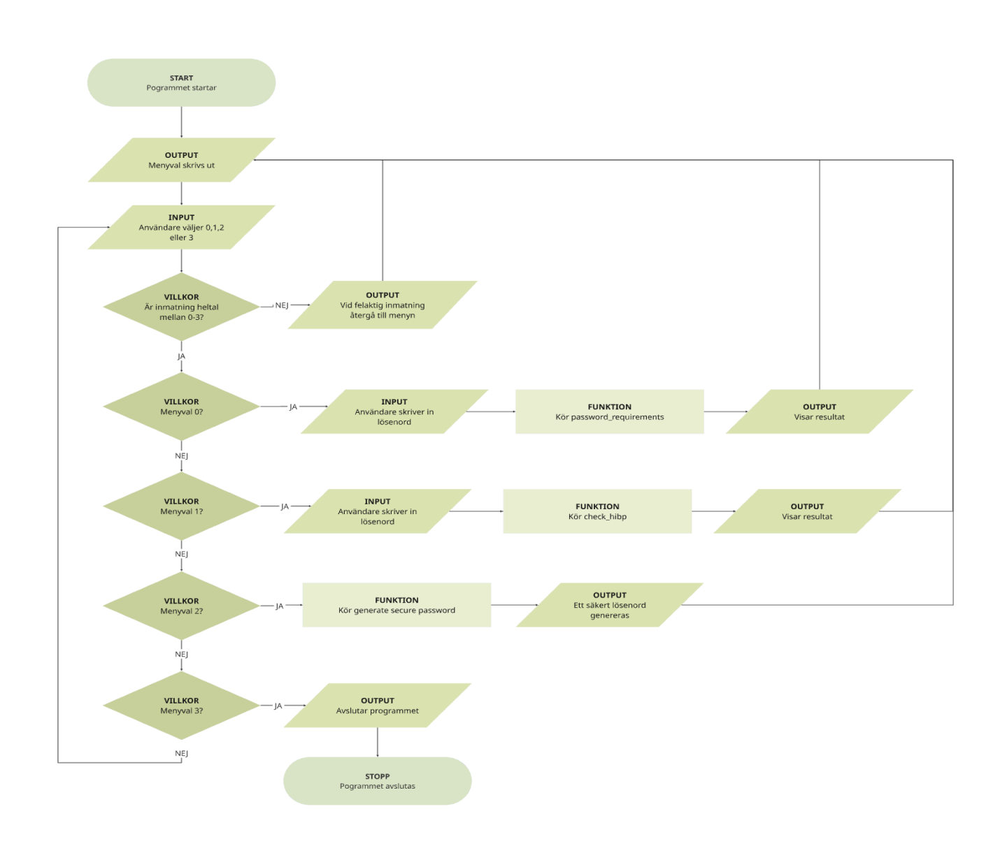

## Secure Password Checker

Programmet kontrollerar användarens nuvarande lösenordsstyrka, användaren kan även kontrollera om ett lösenord förekommer i kända dataläckor via Have I Been Pwned.

### Funktioner
- Säkerställer lösenord (längd, siffror, specialtecken, o.s.v.)
- Kontrollerar om lösenordet är läckt (Använder SHA-1 enligt HIBP)

### Säkerhet
- Inga lösenord skickas i klartext
- Endast hash-prefix skickas till HIPB

### Teknik och moduler
- Python 3
- requests
- hashlib

